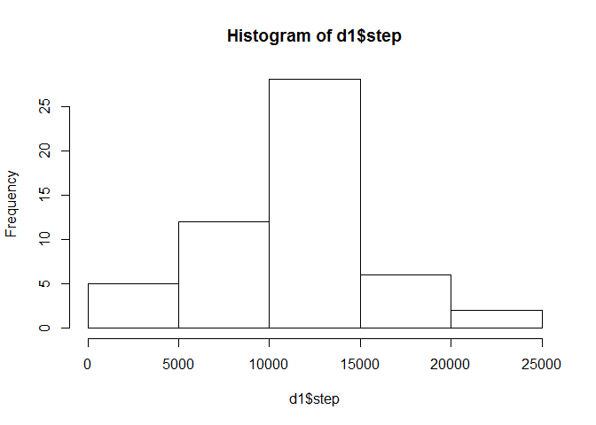
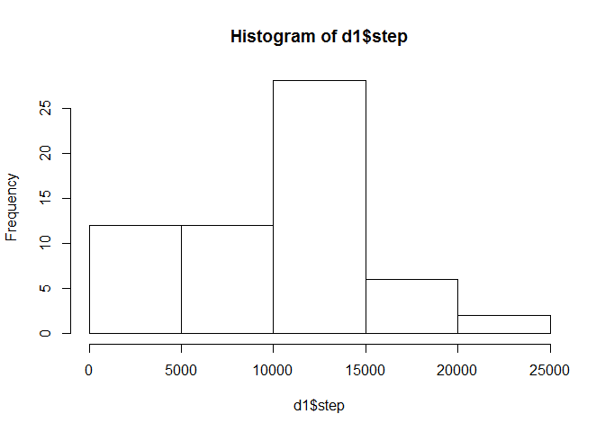
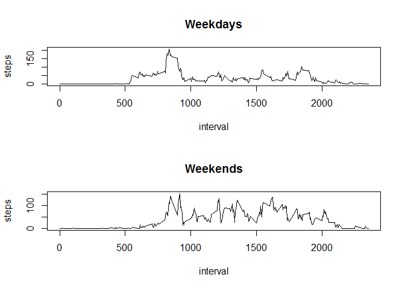

# Reproducible Research: Peer Assessment 1

## Loading and preprocessing the data

```r
library(zoo);
library(dplyr);
data = read.csv("activity.csv")
```


## What is mean total number of steps taken per day?

```r
d1 = data %>% group_by(date) %>% summarise(steps = sum(steps));
hist(d1$step);
```

<!-- -->

```r
mean(na.omit(d1$step));
```

```
## [1] 10766.19
```

```r
median(na.omit(d1$step))
```

```
## [1] 10765
```


## What is the average daily activity pattern?

```r
d2 = data %>% group_by(interval) %>% summarise(steps = mean(na.omit(steps)));
plot(d2, type='l')
```

<!-- -->


```r
d2$interval[which.max(d2$steps)]
```

```
## [1] 835
```

## Imputing missing values

```r
length(data$steps[is.na(data$steps)])
```

```
## [1] 2304
```

Using last measured values. And yes, it differs.

```r
data$steps = na.locf(data$steps, fromLast = TRUE, na.rm = FALSE);
d1 = data %>% group_by(date) %>% summarise(steps = sum(steps));
hist(d1$step);
```

<!-- -->

```r
mean(na.omit(d1$step));
```

```
## [1] 9510.133
```

```r
median(na.omit(d1$step))
```

```
## [1] 10417
```

## Are there differences in activity patterns between weekdays and weekends?

```r
wdays = as.POSIXlt(data$date)$wday 

data_weekday = data[wdays %% 6 > 0,];
data_weekend = data[wdays %% 6 == 0,];

par(mfrow=c(2,1));

d2 = data_weekday %>% group_by(interval) %>% summarise(steps = mean(na.omit(steps)));
plot(d2, type='l',main='Weekdays')

d2 = data_weekend %>% group_by(interval) %>% summarise(steps = mean(na.omit(steps)));
plot(d2, type='l', main='Weekends');
```

<!-- -->
